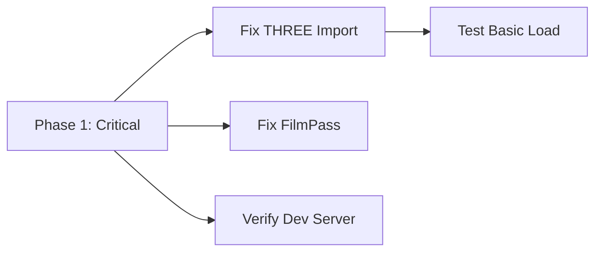

# The Human Blueprint - Recovery & Revival Plan

## Executive Summary

**Project:** "The Human Blueprint" - A spatial computing experience revealing 50,000 years of human mark-making
**Current Status:** Infrastructure complete, visual experience needs significant work
**User Rating:** 4/10 (per BUILD_AUDIT_AND_RECOVERY.md dated Jan 3, 2026)

---

## What Works ✅

| Component | Status | Notes |
|-----------|--------|-------|
| Build System | ✅ | Vite configured, 1.3MB bundle |
| Image Pipeline | ✅ | `npm run ingest` scrapes Met Museum + generates CLIP embeddings |
| Layout Computation | ✅ | `npm run compute-layout` pre-calculates UMAP 3D positions |
| Core Modules | ✅ | All 10+ JS modules present and structured |
| Data | ✅ | 2,039 images in images.json |

---

## What's Broken ❌

### Critical Issues (Blocking)

1. **AudioSystem.js - Missing THREE.js Import**  
   [`src/core/AudioSystem.js:34`](src/core/AudioSystem.js:34) uses `THREE.Euler` but never imports THREE. This causes runtime crash.

2. **FilmPass Deprecation**  
   [`src/core/PostProcessManager.js:5`](src/core/PostProcessManager.js:5) imports deprecated `FilmPass` from Three.js - needs migration to newer API.

3. **Data Quality Mismatch**  
   - Only **39 images** have CLIP vectors + UMAP positions
   - **2,000 legacy images** have random positions (no visual similarity arrangement)
   - Images appear scattered, not meaningfully organized

### Major Issues (UX)

4. **Placeholder Design**  
   [`SceneManager.js:423-468`](src/core/SceneManager.js:423-468) - Placeholders are simple colored rectangles with random noise. Jarring and generic.

5. **Loading Experience**  
   - Images load abruptly despite lazy loading implementation
   - No progressive loading indicator
   - No thumbnails-first approach

6. **Visual Atmosphere**  
   - Missing fog, depth of field effects
   - Lighting too flat (generic 3-point setup)
   - No "uncanny" feeling per PRD vision

7. **Transitions**  
   - Camera movements feel mechanical
   - Rupture effects present but not polished enough
   - No smooth fade-in for distant images

### Minor Issues

8. **OrbitControls Damping**  
   [`SceneManager.js:40-44`](src/core/SceneManager.js:40-44) - Damping enabled but may need tuning for smoother feel

9. **Color Space Handling**  
   Some textures may render with incorrect color space (SRGB vs linear)

---

## Recovery Plan - Phased Approach

### Phase 1: Critical Fixes (Do First)



#### 1.1 Fix AudioSystem THREE Import
```javascript
// src/core/AudioSystem.js - Add at top
import * as THREE from 'three';
```

#### 1.2 Fix PostProcessManager FilmPass
```javascript
// Replace deprecated FilmPass with manual grain shader
// OR use EffectComposer with custom noise pass
```

#### 1.3 Verify Dev Server Runs
```bash
npm install
npm run dev
# Should load without console errors
```

---

### Phase 2: Visual Polish (Core Experience)

#### 2.1 Redesign Placeholders
- Replace solid color rectangles with textured, atmospheric placeholders
- Add subtle animated shimmer/surface detail
- Consider: blurred thumbnail previews, abstract patterns

**File:** [`src/core/SceneManager.js`](src/core/SceneManager.js:423)  
**Target:** Placeholders should feel intentional, not broken

#### 2.2 Add Atmospheric Effects
- Implement depth fog (exponential fog in Three.js)
- Add subtle particle dust floating in space
- Tune post-processing: stronger bloom, cinematic grain

**File:** [`src/core/SceneManager.js`](src/core/SceneManager.js:10)  
**Code location:** `this.scene.fog = new THREE.FogExp2(0x000000, 0.015);`

#### 2.3 Improve Lighting
- Replace flat 3-point lighting with dramatic single source
- Add image-reactive emissive glow based on content colors

#### 2.4 Smooth Transitions
- Add easing curves to camera movements (not linear)
- Implement smooth LOD fade-in (not instant)
- Add motion blur during rapid camera movement

---

### Phase 3: Data & Arrangement (Meaningful Organization)

#### 3.1 Process Remaining Images
```bash
# Run CLIP on all 2,000 legacy images
npm run ingest

# Recompute UMAP layout for all images
npm run compute-layout
```

#### 3.2 Add More Museum Sources
- Smithsonian API (needs API key)
- Louvre Open Access
- British Museum
- Wikidata for metadata enrichment

#### 3.3 Verify Arrangement
- Ensure similar images cluster together
- Test with known image pairs (should be near each other)

---

### Phase 4: UX Refinement

#### 4.1 Loading Experience
- Add thumbnail-first loading (small image → full res)
- Show loading progress with atmospheric animation
- Prioritize visible images only

#### 4.2 Gaze Feedback
- More subtle highlight effect (not just scale/glow)
- Consider "recognition pulse" when user sees similar content

#### 4.3 Rupture Polish
- More dramatic visual effects
- Sound design refinement
- Connecting thread visualization (show what links the images)

---

### Phase 5: Performance & Scale

#### 5.1 Performance Optimization
- Reduce initial load count (50 → 20 immediate, rest lazy)
- Add texture compression for mobile
- Implement LOD (Level of Detail) for distant images

#### 5.2 Mobile Optimization
- Touch gesture support (already present, needs testing)
- Reduced post-processing on mobile
- Lower resolution textures

---

## Implementation Priority

| Priority | Task | Est. Effort | Impact |
|----------|------|-------------|--------|
| P0 | Fix THREE import in AudioSystem | 5 min | Blocking |
| P0 | Fix FilmPass deprecation | 30 min | Blocking |
| P1 | Verify dev server runs | 10 min | Validation |
| P1 | Better placeholders | 2 hours | High |
| P1 | Atmospheric fog + effects | 2 hours | High |
| P2 | Improve lighting | 1 hour | Medium |
| P2 | Smooth camera transitions | 2 hours | Medium |
| P2 | Process all images through CLIP | 30 min | High |
| P3 | Loading UX improvements | 4 hours | Medium |
| P3 | Mobile optimization | 4 hours | Low |

---

## Files Requiring Changes

### Must Fix
- [`src/core/AudioSystem.js`](src/core/AudioSystem.js) - Add THREE import
- [`src/core/PostProcessManager.js`](src/core/PostProcessManager.js) - Replace FilmPass

### Should Improve
- [`src/core/SceneManager.js`](src/core/SceneManager.js) - Fog, placeholders, lighting
- [`src/core/ImageLoader.js`](src/core/ImageLoader.js) - Loading UX
- [`src/core/RuptureSystem.js`](src/core/RuptureSystem.js) - Transition polish

### Consider
- [`public/images.json`](public/images.json) - Regenerate with full CLIP processing
- New placeholder texture design

---

## Next Steps

1. **Switch to Code Mode** to fix critical issues (AudioSystem import, FilmPass)
2. **Verify app loads** with `npm run dev`
3. **Iterate on visual polish** - placeholders, fog, lighting
4. **Run data pipeline** to process all images
5. **User test** and iterate on experience

---

## PRD Alignment Checklist

Per the original PRD, the experience should create:
- [ ] "What the fuck did I just experience?" reaction
- [ ] "I can't stop thinking about it" feeling  
- [ ] Uncomfortable but compelling disorientation
- [ ] "I saw myself in there" recognition moment
- [ ] "Time collapsed" temporal disorientation

**Current gap:** The technical infrastructure exists but the *feeling* is missing. Focus on atmosphere and visual polish to achieve PRD vision.

---

*Generated: February 13, 2026*
*For: Art_History Project Revival*
